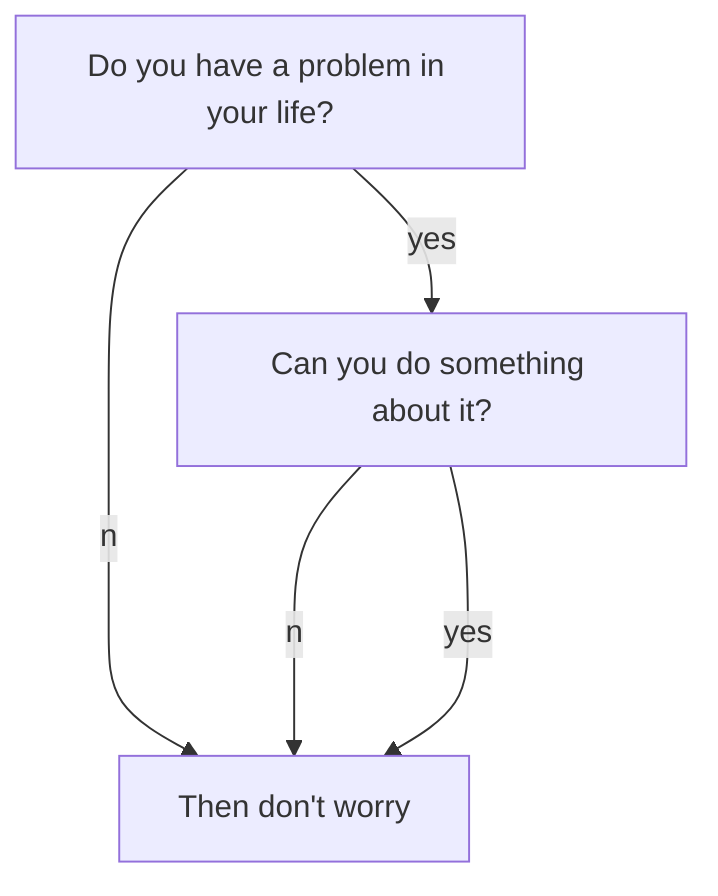

This template is a tutorial on creating a page on the ARC wiki. In it we will cover structure, basic syntax, and other useful hints.

If you're reading this, you have some valuable knowledge built over the course of working on an ARC project that you want to share so others can benefit from your efforts.  

The first 100 words are used as an excerpt on the wiki's Index. No images, HTML, or special formating should be used in this section as it won't be displayed properly.

If you're writing a tutorial, use this section to specify what the reader will be able to accomplish and the tools you will be using. If you're writing an article, this section should be used to encapsulate the topic covered. Use Wikipedia for inspiration on how to write a proper introduction to a topic.

## First subheading
Use this section to cover important terms and information useful to completing the tutorial or understanding the topic addressed. Don't be afraid to include to other wiki entries that would be useful for what you intend to cover. Notice that there are two \#'s used for subheadings; that's the minimum. Each additional sublevel will have an added \#. It's strongly recommended that you create and work from an outline.

This section covers the basic syntax and some rules of thumb for writing.

### Basic syntax
A line in between create a separate paragraph. *This is italicized.* **This is bold.** Here is [a link](/). If you want to display the URL, you can do it like this <http://ri.cmu.edu/>.

> This is a note. Use it to reinforce important points, especially potential show stoppers for your readers. It is also appropriate to use for long quotes from other texts.


#### Bullet points and numbered lists
Here are some hints on writing (in no particular order):
- Focus on application knowledge.
  - Write tutorials to achieve a specific outcome.
  - Relay theory in an intuitive way (especially if you initially struggled).
    - It is likely that others are confused in the same way you were. They will benefit from your perspective.
  - You do not need to be an expert to produce useful content.
  - Document procedures as you learn them. You or others may refine them later.
- Follow KISS (Keep It Simple Stupid) 
  - Boil complexity down to its core ideas 
  - Write [clearly](https://stanford.edu/class/ee267/WIM/writing_style_guide.pdf)

Entries in the Wiki should follow this format:
1. Excerpt introducing the entry's contents.
  - Be sure to specify if it is a tutorial or an article.
  - Remember that the first 100 words get used else where. A well written excerpt ensures that your entry gets read.
2. The content of your entry.
3. Summary.
4. See Also Links (relevant articles in the Wiki).
5. Further Reading (relevant articles on other sites).
6. References.

#### Code snippets
You can display code inline like `this`. This can be used for `filenames` and `ROS_node_names`.

Larger chunks of code should use this format:
```
def recover_msg(msg):

        // Good coders comment their code for others.

        pw = ProtocolWrapper()

        // Explanation.

        if rec_crc != calc_crc:
            return None
```
This would be a good spot further explain you code snippet. Break it down for the user so they understand what is going on.

## Second subheading 

### Helpful Markdown Extensions

#### LaTex Math Support
Here is an example MathJax inline rendering $ \phi(x\|y) $ (note the additional escape for using \|), and here is a block rendering:
$$ \frac{1}{n^{2}} $$

#### Mermaid + Charts Support

Example of [Mermaid](https://mermaidjs.github.io/) diagrams 



[Chart.js](http://www.chartjs.org/docs/latest/) Support
```chart
{
  "type": "line",
  "data": {
    "labels": [
      "January",
      "February",
      "March",
      "April",
      "May",
      "June",
      "July"
    ],
    "datasets": [
      {
        "label": "# of bugs",
        "fill": false,
        "lineTension": 0.1,
        "backgroundColor": "rgba(75,192,192,0.4)",
        "borderColor": "rgba(75,192,192,1)",
        "borderCapStyle": "butt",
        "borderDash": [],
        "borderDashOffset": 0,
        "borderJoinStyle": "miter",
        "pointBorderColor": "rgba(75,192,192,1)",
        "pointBackgroundColor": "#fff",
        "pointBorderWidth": 1,
        "pointHoverRadius": 5,
        "pointHoverBackgroundColor": "rgba(75,192,192,1)",
        "pointHoverBorderColor": "rgba(220,220,220,1)",
        "pointHoverBorderWidth": 2,
        "pointRadius": 1,
        "pointHitRadius": 10,
        "data": [
          65,
          59,
          80,
          81,
          56,
          55,
          40
        ],
        "spanGaps": false
      }
    ]
  },
  "options": {}
}
```

### Images/GIFs

Add images to the `assets/images` folder that is present in every project directory
```

```

or using html if you want to define the width of the image
```

```


Adding GIFs is the same process as images except put them in `assets/gifs`. 

### Videos 

Videos take up a lot of space in GitHub, so we recommend using Google Drive as it is currently supported.

#### Google Drive

1. For the desired video, change the link sharing setting to `On - Anyone with the link`. This will make the video accessible to anyone who has the link as no sign-in is required.
**Important**: If you do not change the video setting to this option, your video will not show.
2. Double click the video to show the preview. Click the setting options and select "Open in new window". Now click on the setting option again and select "Embed item". The iframe code should appear. For the following code, `1EC8BnjJMon-vqy-UhLKk9sf_oukZzEbP/preview` would be your video ID.

```
<iframe src="https://drive.google.com/file/d/1EC8BnjJMon-vqy-UhLKk9sf_oukZzEbP/preview"></iframe>
```

3.
Lastly, add the following snippet to [include](https://jekyllrb.com/docs/includes/) the embedded video in your article. Remove the space between `{` and `%` to see the embed.
```
{ % include googleDrivePlayer.html id="id" % }
```

#### Other

To add support for other options, refer to [this repo](https://github.com/nathancy/jekyll-embed-video). 

## Summary
Use this space to reinforce key points and to suggest next steps for your readers.

## See Also:
- Links to relevant articles

## References
- Links to References go here.
- Adapted from the [Robotics Knowledgebase](https://github.com/RoboticsKnowledgebase/roboticsknowledgebase.github.io/blob/master/_templates/template.md) template
- Video embed for Google Drive steps adapted from [jekyll embed video repo](https://github.com/nathancy/jekyll-embed-video)
