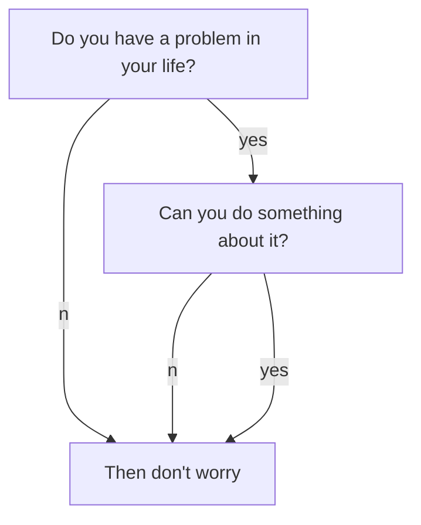

Object detection is an essential vision component for robots. This tutorial will cover how to create an object detection pipeline using YOLOv5 that integrates with ROS.


## 


#### Mermaid + Charts Support

Example of [Mermaid](https://mermaidjs.github.io/) diagrams 



[Chart.js](http://www.chartjs.org/docs/latest/) Support
```chart
{
  "type": "line",
  "data": {
    "labels": [
      "January",
      "February",
      "March",
      "April",
      "May",
      "June",
      "July"
    ],
    "datasets": [
      {
        "label": "# of bugs",
        "fill": false,
        "lineTension": 0.1,
        "backgroundColor": "rgba(75,192,192,0.4)",
        "borderColor": "rgba(75,192,192,1)",
        "borderCapStyle": "butt",
        "borderDash": [],
        "borderDashOffset": 0,
        "borderJoinStyle": "miter",
        "pointBorderColor": "rgba(75,192,192,1)",
        "pointBackgroundColor": "#fff",
        "pointBorderWidth": 1,
        "pointHoverRadius": 5,
        "pointHoverBackgroundColor": "rgba(75,192,192,1)",
        "pointHoverBorderColor": "rgba(220,220,220,1)",
        "pointHoverBorderWidth": 2,
        "pointRadius": 1,
        "pointHitRadius": 10,
        "data": [
          65,
          59,
          80,
          81,
          56,
          55,
          40
        ],
        "spanGaps": false
      }
    ]
  },
  "options": {}
}
```

#### Images

Add images to the `assets/images` folder that is present in every project directory


## Summary
Use this space to reinforce key points and to suggest next steps for your readers.

## See Also:
- Links to relevant articles

## References
- Links to References go here.
- Adapted from the [Robotics Knowledgebase](https://github.com/RoboticsKnowledgebase/roboticsknowledgebase.github.io/blob/master/_templates/template.md) template
