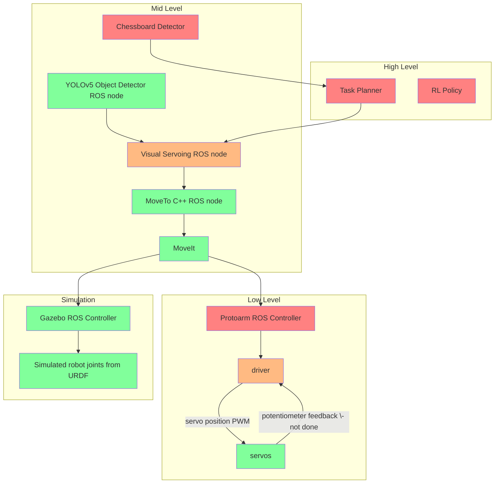
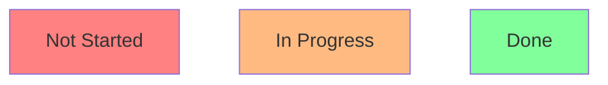
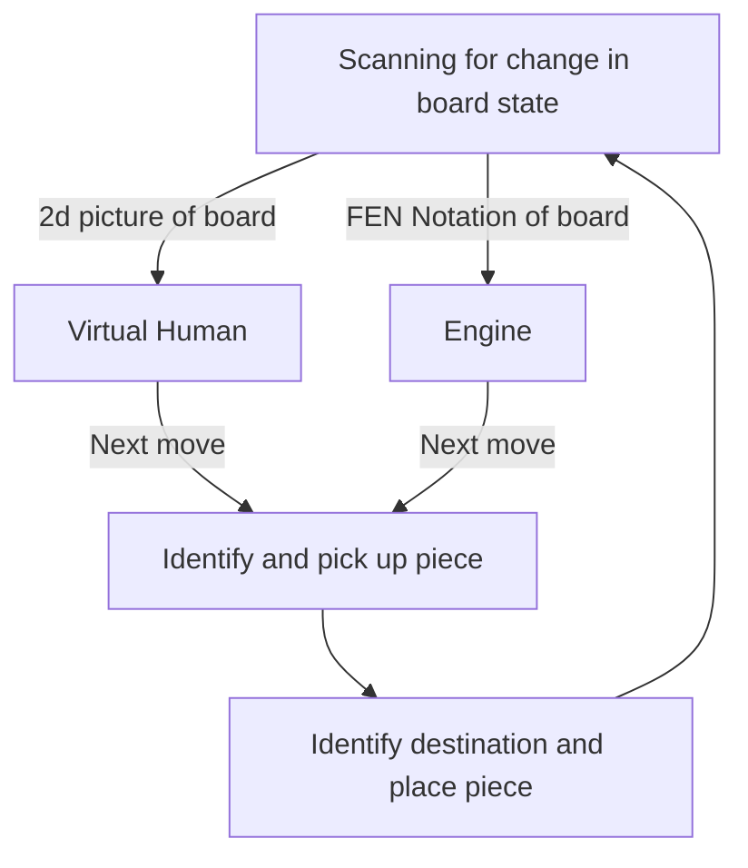
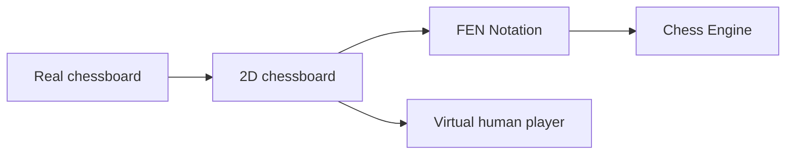

> If you want to look at code and run some of it, check out [arc_robot_arm](https://github.com/purdue-arc/arc_robot_arm) README for quick start details and usage instructions.

## System Overview

### Protoarm

## High level

### Task Planner
After the robot turns on, what does it do? This is the job of the task planner. Take inputs from the world using other tools in the stack, analyze, and make a decision. The decision flowchart that a robot can make is modeled here:

Some resources we can try to use to complete the above:
1. [FEN to stockfish chess engine](https://github.com/zhelyabuzhsky/stockfish)
2. 2D chess -> virtual human can be done using a text message API of some sort, where images of the board are sent over text and replies with the move can be recieved and played.

## Mid level

### Chess Piece Detection with YOLOv5
How does our robot determine which piece is which? This is a common scenario in many real-world use cases and object detection, as the name suggests, is used to detect the chess pieces.

The object detection stack consists of the [YOLOv5](https://github.com/ultralytics/yolov5) object detection model trained on a custom dataset and outputs 2d bounding boxes. 

For chess, the model is trained with a custom large chess piece dataset of 500+ images stored on [roboflow](https://app.roboflow.com/). [Here](https://colab.research.google.com/drive/1XJ82eVA0cEfTczXFMtV1sunqvsfiJWQ0?usp=sharing) is a simple colab that walks through the training process using a Roboflow dataset.

Inference is using the `yolov5_pytorch_ros` ROS package using the `detector` ROS node using Python/PyTorch, allowing it to communicate detections and classes to other nodes such as for visual servoing. It reaches around 15-20 FPS without a GPU on a Mac.

> See [chess_piece_detector](https://github.com/purdue-arc/arc_robot_arm/tree/main/chess_piece_detector) for quick start details and usage instructions.

### Visual Servoing (WIP) 
Without "eyes", our robot is blind and any error that the robot makes cannot be accounted for and adjusted for accordingly, resulting in lots of fails. Visual servoing is one method of providing eyes for our robot and the algorithm to control for any errors that the robot makes.

We are using image-based visual servoing to localize the robot arm hand over an object in a graspable configuration, using images/2d bounding boxes as inputs to the system and servo commands as outputs.

> Visual servoing system diagram ([source](https://www.researchgate.net/figure/Visual-servoing-closed-loop_fig1_265436696))

See the `protoarm_visual_servoing` package for more details.

### Kinematics and Planning 

As a human, it is simple to move our joints and pick something up in 3D space. For a robot arm, it knows nothing of 3D space, only numerical angles for each of its joints. So, we use [inverse kinematics](https://en.wikipedia.org/wiki/Inverse_kinematics) (IK), the mathematical process of converting 3D space coordinates to joint angles, to determine the final position for the robot arm. 

Now what happens between the start and final position? That's the job of the motion planner. It determines a safe collision-free trajectory for each joint and creates the plan. Then, the plan is executed, either in real life or in simulation. 

As of now, all the kinematics and planning heavy lifting is done by [MoveIt](http://moveit.ros.org/). The `protoarm_kinematics` package houses a wrapper written in C++ that abstracts the process of sending [JointState](http://docs.ros.org/en/melodic/api/sensor_msgs/html/msg/JointState.html) or [Pose](http://docs.ros.org/en/noetic/api/geometry_msgs/html/msg/Pose.html) goals. 

The wrapper is interfaced externally using the `move_to` node. Refer to the [test_kinematics](https://github.com/purdue-arc/arc_robot_arm/blob/main/protoarm_kinematics/src/test_kinematics) rospy file in `protoarm_kinematics/src` for usage of the `move_to` node. 

This package is also where we would keep our custom kinematics plugin and planning library if we choose to make it from scratch, instead of the default [KDL](https://ros-planning.github.io/moveit_tutorials/doc/kinematics_configuration/kinematics_configuration_tutorial.html#the-kdl-kinematics-plugin) kinematics plugin and [OMPL](https://ros-planning.github.io/moveit_tutorials/doc/ompl_interface/ompl_interface_tutorial.html) motion planning library. 

> See [protoarm_kinematics](https://github.com/purdue-arc/arc_robot_arm/tree/main/protoarm_kinematics) for quick start details and usage instructions.

### Chessboard Detection
Playing chess is more than just picking and placing pieces. The robot needs to actually beat the human. We need to know the exact state of the chessboard, so another person or an overpowered engine can say what move to play next.

Some external projects we plan to use to complete the above:
- [Real chessboard -> 2D chessboard](https://github.com/maciejczyzewski/neural-chessboard )
- [2D chessboard -> FEN Notation](https://github.com/Elucidation/tensorflow_chessbot)

## Low level

### Controller 
`protoarm_control` is the ROS package that ensures that MoveIt execution commands are executed exactly as expected and to a degree of certainty in the real world. 

Right now, the driver communicates directly with MoveIt as the `protoarm_control` package doesn't exist yet.

Given that the protoarm uses some of the cheapest servos on the market, how can we still get dependable sub-millimeter precision to do tasks reliably? One way to do so is to hack our servos to add encoders, and use a control scheme that can take velocity and torque into account.

Inspired by Adam's [Servo Project](https://github.com/adamb314/ServoProject).

### Driver
The `protoarm_driver` is written in Arduino that actually interfaces with the servos and encoders. It sets joint limits, does coordinate frame conversions from the URDF to the actual robot, converts MoveIt angles to servo joint angles $$(-\pi,\pi)$$ to $$(0^\circ,180^\circ)$$, and executes servo commands using PWM to the servos.

## Simulation

### Gazebo

There are lots of benefits from simulation spanning from speeding up development and testing of software, realistic environments for reinforcement learning, and testing proof of concepts. 

Our arm is simulated in Gazebo with a Realsense D435 camera (`realsense_ros_gazebo`), chessboard, and chess pieces (`chessboard_gazebo`). The robot arm and the camera are represented in [URDF](http://wiki.ros.org/urdf/XML/model). 

Sensors, actuation, gazebo plugins, and more are [specifications](http://wiki.ros.org/urdf/XML) that can be added. For the arm, these specifications exist in the `.xacro` files in the `urdf` folder of the `protoarm_description` ROS package.

Gazebo uses SDF models (in `models` folder of `chessboard_gazebo`) to represent static assets in the simulation like the chess pieces and chessboard. These objects are then spawned into a Gazebo world (along with the robot URDF), represented with a `.world` file.

> See [protoarm_bringup](https://github.com/purdue-arc/arc_robot_arm/tree/main/protoarm_bringup) for quick start details and usage instructions.



## To-do

#### Task Planner
- [ ] Implement Planner 
- [ ] FEN -> Stockfish 
- [ ] 2D chessboard -> virtual human 

#### Chess Piece Detection
- [ ] Open-source dataset 

#### Visual Servoing
- [ ] Implement feature extraction using OpenCV
- [ ] Implement controller

#### Chessboard Detection
- [ ] ROS node that can output 2d chessboard image and/or FEN

#### Controller 
- [ ] Implement controller

#### Driver
- [ ] Purchase and assemble encoder hardware on servos
- [ ] Write driver for encoder 
